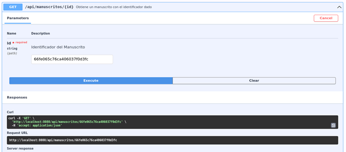

# CoordLib Service - Microservicio en Java con Spring Boot

## Introducción
CoordLib Service es un microservicio desarrollado en Java con Spring Boot como parte del diplomado "Desarrollo y Despliegue de Aplicaciones Cloud Native en Ambientes Híbridos". Su objetivo es proporcionar una solución modular y escalable que pueda integrarse fácilmente en arquitecturas basadas en microservicios.

El servicio está diseñado para ejecutarse en Kubernetes, aprovechando las ventajas de la orquestación de contenedores, su proceso de integración y despliegue continuo (CI/CD) está automatizado con Tekton y requiere de una base de datos MongoDB para la persistencia de la información.

## Objetivos

* Desarrollar un microservicio flexible y escalable basado en Java Spring Boot.
* Implementar prácticas de Cloud Native para garantizar portabilidad.
* Automatizar el flujo de desarrollo e implementación mediante Tekton.

## Infraestructura Tecnológica
* **Java (Spring Boot):** Desarrollo del microservicio
* **MongoDB:** Método de persistencia a través de una base de datos NoSQL
* **Kubernetes:** Orquestación de contenedores. También puede ejecutarse en **OpenShift**
* **Tekton:** Automatización de CI/CD
* **Git:** Gestor de versiones y flujo de trabajo

## 
* Código fuente disponible en: [CoordLib Service - GitHub Repository](https://github.com/michcatg/diplomado)
* Repositorio de imágenes Docker: [Docker Hub](https://hub.docker.com/r/mitchcatg/coordlib-servicem5/)

## Flujo de trabajo y estrategia de ramas
El flujo de trabajo par el desarrollo organizado y colaborativo del presente proyecto sigue la siguiente estrategia de ramas:

### Ramas principales
* main
  * Contiene el código en producción y solo se actualiza con cambios estables, revisados y probados
* dev
  * Integra cambios de las features desarrolladas antes de fusionarlos a main

### Ramas de trabajo
* feature/nueva-feature
  * Desarrolla nuevas funcionalidades (una por cada funcionalidad distinta)
  * Creada a partir de dev y se integra a dev una vez completada la funcionalidad (Pull Request)
* hotfix/arreglo
  * Corrige errores de main y se crea desde main

## Despliegue
El proceso de despliegue en Kubernetes está documentado en el archivo [manifiestos/readme.md](https://github.com/michcatg/diplomado/tree/main/manifiestos). Este documento contiene instrucciones detalladas sobre cómo desplegar el servicio utilizando los manifiestos de Kubernetes y el pipeline de Tekton.

## Interacción con el Microservicio
En esta sección se describe cómo interactuar con el microservicio CoordLib Service, incluyendo un diagrama que ilustra la arquitectura básica y el flujo de información cuando se realiza una solicitud de usuario. También se detallan los endpoints disponibles y cómo utilizarlos.


Diagrama de la arquitectura básica de CoordLib Service

### Endpoints
1.	Para explorar y probar los endpoints disponibles, abre un navegador y navega a `/swagger-ui/index.html`. Esta interfaz proporciona una manera interactiva de visualizar y probar las API del microservicio.


Interfaz de Swagger UI para explorar y probar los endpoints del microservicio

#### Registro de manuscritos
1.	Pruebe el endpoint POST /api/manuscritos, con el siguiente cuerpo de solicitud:

```json
{
  "titulo": "La democracia en México",
  "tipoPublicacion": "Libro",
  "formatos": [
    {
      "formato": "PDF"
    }
  ],
  "perfil": "Obra sobre la democracia en México",
  "autores": [
    {
      "nombres": "Miguel Armando",
      "primerApellido": "López",
      "segundoApellido": "Leyva",
      "correo": "miguel@mail.com",
      "rol": "Autor"
    },
    {
      "nombres": "Lusia",
      "primerApellido": "Gómez",
      "segundoApellido": "Pérez",
      "correo": "luisa@mail.com",
      "rol": "Autor"
    }
  ]
} 
```


Petición POST /api/manuscritos mencionada anteriormente

2. El código de respuesta del servidor debió de ser 201


Respuesta del servidor para la petición POST /api/manuscritos

3.	Para verificar que el manuscrito se haya registrado correctamente, revise la sección de *"Consulta de todos los manuscritos registrados"* de la presente sección

#### Consulta de todos los manuscritos registrados
1.	Para consultar toda la lista de manuscritos registrados, deberá de hacer uso de la interfaz de Swagger UI en el navegador, y mandar a llamar el endpoint GET /api/manuscritos, sin ningún cuerpo de solicitud ni parámetros adicionales

2.	La consulta anterior debió de regresar una respuesta con código 200, y en el cuerpo, la lista de manuscritos registrados


#### Consulta de un manuscrito por ID
1.	Para consultar los datos de un manuscrito a través de su ID, deberá de hacer uso de la interfaz de Swagger UI en el navegador, y mandar a llamar el endpoint GET /api/manuscritos/{id}, sin ningún cuerpo de solicitud, enviando como parámetro id, el identificador del manuscrito. Para el ejemplo, el identificador es 66fe065c76ca406037f0d3fc, pero este puede variar al momento de hacer la prueba, se deberá ingresar un identificador válido, ya que este es generado automáticamente al momento de hacer el registro.



2. La consulta anterior debió de regresar una respuesta con código 200, y en el cuerpo, los datos del manuscrito consultado


...

> Verificación de mi CI/CD desde mi repositorio `michcatg/diplomado` en github
