# Guía de CICD para la construcción despliegue de la aplicación Java con Tekton

## Notas generales
Para ejecutar los taskruns y pipelinesruns de este proyecto, es necesario ubiarse en el namespace `diploe2-gvmc`. Para ello, ejecute el siguiente comando:

## Ejecución de tasksruns de forma independiente con Tekton
Si se desea ejecutar los tasksruns de forma independiente, se pueden seguir los siguientes pasos:

### Clonación del código fuente de la aplicación
El primer paso para crear la imagen de la aplicación Java es clonar el código fuente de la aplicación. Para ello:
* Debes de asegurarte de que el Task de git-clone ya se encuentra en el cluster de Kubernetes. Si no es así, debes de crearlo.
* Debes de crear el taskrun que utilice el task de git-clone. Para ello, debes de crear el taskrun definido en el archivo [taskrun-git-clone.yaml](taskruns/taskrun-git-clone.yaml). Para crear el taskrun, ejecuta el siguiente comando:

```bash
kubectl create -f taskrun-git-clone.yaml
```
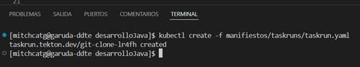

* Debes de comprobar que el taskrun se ha ejecutado correctamente. Para ello, consultamos el log de salida:

```bash
kubectl logs git-clone-[xxx]
```

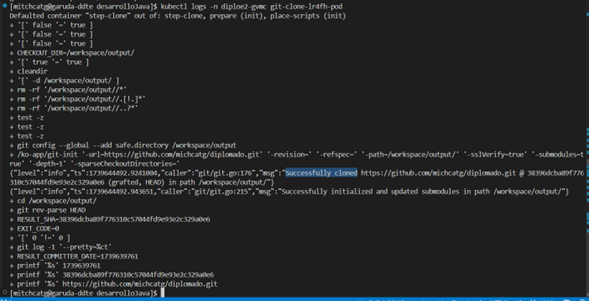

#### Comprobación de la clonación del código fuente
Es posible comprobar que el código fuente ha sido clonado con éxito, ejecutando el taskrun de listDirectory
 Para ello:
* Debes de asegurarte de que el Task de list-directory ya se encuentra en el cluster de Kubernetes. Si no es así, debes de crearlo.
* Debes de crear el taskrun que utilice el task de list-directory. Para ello, debes de crear el taskrun definido en el archivo [listDirectory.yaml](taskruns/listDirectory.yaml). Para crear el taskrun, ejecuta el siguiente comando:

```bash
kubectl create -f listDirectory.yaml
```
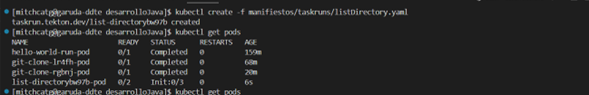

* Debes de comprobar que el taskrun se ha ejecutado correctamente. Para ello, consultamos el log de salida:

```bash
kubectl logs listdirectory-[xxx]
```

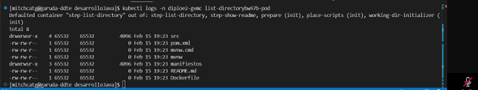

**Nota:** La ejecución de este taskruns es opcional, y perjudica de alguna forma el contenido del directorio de trabajo, por lo que se sugiere rehacer el clonado antes de seguir con los siguientes pasos.

### Construcción de la imagen de la aplicación Java
Una vez que el código fuente ha sido clonado con éxito, el siguiente paso es construir la imagen de la aplicación Java. Para ello:
* Debes de asegurarte de que el Task de maven ya se encuentra en el cluster de Kubernetes. Si no es así, debes de crearlo.
* Debes de crear el taskrun que utilice el task de maven. Para ello, debes de crear el taskrun definido en el archivo [mavenTaskrun.yaml](taskruns/mavenTaskrun.yaml). Para crear el taskrun, ejecuta el siguiente comando:

```bash
kubectl create -f maventaskrun.yaml
```
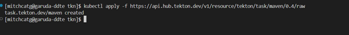

* Debes de comprobar que el taskrun se ha ejecutado correctamente. Para ello, consultamos el log de salida:

```bash
kubectl logs maven-[xxx]
```

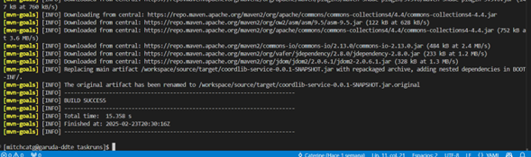

### Push de la imagen de la aplicación Java al registro de imágenes
Una vez que la imagen de la aplicación Java ha sido construida con éxito, el siguiente paso es subir la imagen al registro de imágenes. Para ello:
* Debes de asegurarte de que el Task de buildah ya se encuentra en el cluster de Kubernetes. Si no es así, debes de crearlo.
* Debes de crear el taskrun que utilice el task de buildah. Para ello, debes de crear el taskrun definido en el archivo [buildhaTaskrun.yaml](taskruns/buildhaTaskrun.yaml). No olvides cambiar la versión de la imagen en el archivo [buildhaTaskrun.yaml](taskruns/buildhaTaskrun.yaml) antes de crear el taskrun. Para crear el taskrun, ejecuta el siguiente comando:

```bash
kubectl create -f buildhaTaskrun.yaml
```
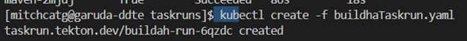

* Debes de comprobar que el taskrun se ha ejecutado correctamente. Para ello, consultamos el log de salida:

```bash
kubectl logs buildah-[xxx]
```

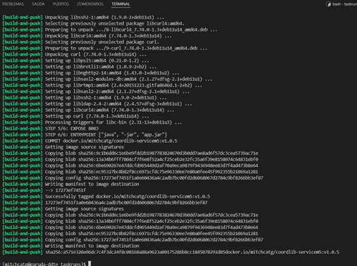

### Despliegue de la aplicación Java en el cluster de Kubernetes
Una vez que la imagen de la aplicación Java ha sido subida al registro de imágenes, el siguiente paso es desplegar la aplicación en el cluster de Kubernetes. Para ello:
* Debes de asegurarte de que el Task de kubernetes-actions ya se encuentra en el cluster de Kubernetes. Si no es así, debes de crearlo.
* Debemos de crear el taskrun que utilice el task de kubernetes-actions. Para ello, debes de crear el taskrun definido en el archivo [deployKubernetesActionsTaskrun.yaml](taskruns/deployKubernetesActionsTaskrun.yaml). Para crear el taskrun, ejecuta el siguiente comando:

```bash
kubectl create -f deployKubernetesActionsTaskrun.yaml
```
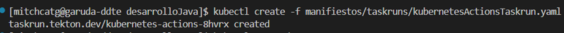

* Debes de comprobar que el taskrun se ha ejecutado correctamente. Para ello, consultamos el log de salida:

```bash
kubectl logs kubernetes-actions-[xxx]
```
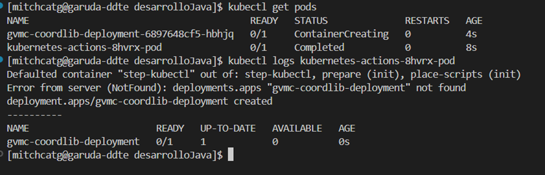

**Nota:** El deploy se creó correctamente pero no se levanta porque faltan los parámetros de conexión a la base de datos y del puerto que requiere la imagen.

## Ejecución de pipelines con Tekton
Si desea que todas las tareas se ejecuten de forma automática, puede utilizar pipelines. Para ello, siga los siguientes pasos:

* Actualice el archivo [pipelinerun-cicd.yaml](tekton/pipelines/pipelinerun-cicd.yaml) con la información de la nueva imagen de la aplicación Java.
* Cree el pipeline y el pipeline run. Para ello, ejecute el siguiente comando:

```bash
kubectl create -f pipelinerun-cicd.yaml
```

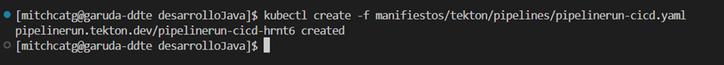

* Debes comprobar que el pipeline run se ha ejecutado correctamente. Para ello, consultamos el log de salida:

```bash
tkn pipelinerun logs pipelinerun-cicd-[xxx]
```
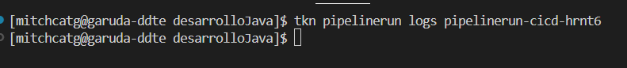

Dado que mi cli de tkn no muestra la salida de los logs, se muestra la salida, se muestran los resultados de consultar todos los logs de cada taskrun creada.

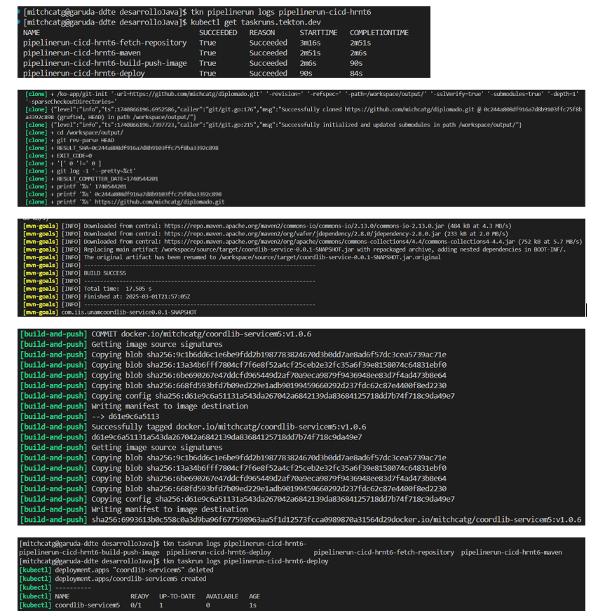
